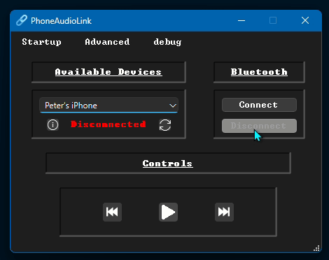

# PhoneAudioLink

This readme was generated using Claude AI.

**Stream Bluetooth audio from your phone to your PC with a clean, modern interface.**

PhoneAudioLink transforms your Windows PC into a Bluetooth audio receiver (A2DP Sink), allowing you to play music, podcasts, and any audio from your phone through your computer's speakers or headphones.



---

## ✨ Features

- 🎵 **Stream Audio** - Play audio from your phone through your PC speakers
- 🔵 **Bluetooth A2DP Sink** - Leverages Windows 10's native A2DP support
- 🎨 **Modern UI** - Clean, intuitive interface with animated buttons
- 🔔 **System Tray Integration** - Minimize to tray and control from notification area
- 💾 **Auto-Reconnect** - Remembers your device and reconnects automatically
- ⚙️ **Easy Setup** - Automatic device discovery and one-click connection
- 🌓 **Theme Support** - Adapts to Windows light/dark mode

---

## 🎯 Use Cases

- **Wireless Audio** - Eliminate the need for AUX cables
- **Multiple Speakers** - Use your PC's better speakers for phone audio
- **Hands-Free** - Control playback while working at your computer
- **Presentations** - Play phone audio during presentations
- **Gaming** - Listen to music from your phone while gaming on PC

---

## 📋 Requirements

### Minimum System Requirements:
- **Windows 10** version 2004 (May 2020 Update) or later
- **Bluetooth adapter** (built-in or USB)
- **Phone with Bluetooth** (iPhone, Android, or any A2DP source device)

### Development Requirements:
- **Visual Studio 2019/2022** with C++ desktop development
- **Qt 6.2+** compiled with MSVC (MinGW not supported)
- **Windows SDK** 10.0.19041.0 or later
- **MSVC compiler** (required for WinRT support)

---

## 🚀 Installation

### For Users:

1. **Download** the latest release from [Releases](https://github.com/PolymorphicAgent/PhoneAudioLink/releases)
2. **Run** the installer
3. **Pair** your phone in Windows Settings → Bluetooth & devices
4. **Connect** via the app and enjoy!

### For Developers:

```bash
# Clone the repository
git clone https://github.com/yourusername/PhoneAudioLink.git
cd PhoneAudioLink

# Open in Qt Creator
qtcreator PhoneAudioLink.pro

# Run and build in qt creator
```

---

## 📖 How to Use

### First-Time Setup:

1. **Pair Your Phone**
   - Open Windows Settings → Bluetooth & devices
   - Turn on Bluetooth
   - Click "Add device" → Bluetooth
   - Select your phone and complete pairing

2. **Launch PhoneAudioLink**
   - The app will automatically discover paired devices
   - Your phone should appear in the device dropdown

3. **Connect**
   - Select your phone from the dropdown
   - Click the "Connect" button
   - Wait for "Connected" status

4. **Play Audio**
   - Start playing music/videos on your phone
   - Audio will stream through your PC speakers!

---

## 🔧 Technical Details

### Architecture

PhoneAudioLink uses a **hybrid architecture** combining Qt for UI and Windows Runtime (WinRT) for Bluetooth:

```
Phone (A2DP Source)
    ↓ Bluetooth
Windows 10 Native A2DP Sink
    ↓ AudioPlaybackConnection API
PhoneAudioLink (Qt + WinRT)
    ↓
PC Speakers
```

### Key Technologies:

- **Qt 6** - Cross-platform UI framework
- **C++/WinRT** - Modern C++ projection for Windows Runtime
- **Windows.Media.Audio.AudioPlaybackConnection** - Native A2DP sink
- **Windows.Devices.Enumeration.DeviceWatcher** - Bluetooth device discovery
- **Qt Bluetooth** - Additional device information

### What Windows Handles:
- ✅ A2DP protocol negotiation
- ✅ SBC audio codec decoding
- ✅ Audio buffer management
- ✅ Routing to output devices
- ✅ Connection reliability

### What QT Handles:
- ✅ Device discovery and selection
- ✅ Connection management
- ✅ User interface
- ✅ Status notifications
- ✅ Settings persistence

---

## ⚙️ Configuration

### Settings Available:

- **Maximize Bluetooth Compatibility** - Show all Bluetooth devices (not just phones)
- **Connect Automatically** - Auto-connect to last device on startup
- **Start Minimized** - Launch to system tray

Settings are saved to `init.json` in the application directory.

---

## ⚠️ Known Limitations

### Media Controls
**Status:** Not implemented

When your PC acts as an A2DP Sink (receiving audio), the play/pause/forward/back buttons don't control phone playback. This is an **architectural limitation** of the Bluetooth A2DP Sink profile, not a bug.

**Workaround:** Use your phone's physical controls for playback (for now).

**Technical Reason:** Media control requires AVRCP Controller implementation, which is a separate Bluetooth profile that will require significant additional development (~1000+ lines of protocol code). Expect this to take a while to implement!

### Audio Codec
**Status:** SBC only

Windows 10's native A2DP Sink only supports the SBC (Subband Coding) codec. Higher-quality codecs (AAC, aptX, LDAC) are not available.

**Audio Quality:** Good enough for most use cases (music, podcasts, videos).

### Platform Support
**Status:** Windows only

This implementation uses Windows-specific APIs (WinRT) and cannot be ported to Linux or macOS without complete reimplementation using platform-specific Bluetooth stacks.

---

## 🔮 Future Updates

### Planned Features

#### Short-term (Next Release)
- [ ] **Volume Control** - Adjust volume directly from PC
- [ ] **Connection History** - Quick access to recently connected devices
- [ ] **Keyboard Shortcuts** - Global hotkeys for common actions
- [ ] **Notification Customization** - Choose which notifications to show
- [ ] **Connection Status Indicator** - Visual feedback for connection quality

#### Medium-term (Upcoming Versions)
- [ ] **Track Information Display** - Show currently playing song/artist
- [ ] **Album Artwork** - Display album cover in UI
- [ ] **Playback Timeline** - Show progress bar and time remaining
- [ ] **Battery Level Indicator** - Display phone battery status
- [ ] **Multiple Device Support** - Switch between multiple paired devices
- [ ] **Audio Recording** - Capture streaming audio to file
- [ ] **Auto-reconnect on Wake** - Reconnect when PC wakes from sleep

#### Long-term (Future Vision)
- [ ] **AVRCP Controller Implementation** - Full media control from PC
  - Play/pause/forward/back functionality
  - Volume control via AVRCP
  - Track metadata retrieval
  - Requires ~1000+ lines of Bluetooth protocol code
- [ ] **Custom Audio Processing** - EQ, effects, enhancements
- [ ] **Codec Support** - AAC, aptX (requires third-party drivers)

### Community Requests

Have a feature idea? [Open an issue](https://github.com/PolymorphicAgent/PhoneAudioLink/issues) with the `enhancement` label!

---

## 🐛 Troubleshooting

### "WinRT not initialized"
- **Cause:** Not using MSVC compiler or Windows SDK not installed
- **Fix:** Ensure using MSVC (not MinGW) and install Windows SDK 10.0.19041.0+

### "No such interface supported"
- **Cause:** Device not properly paired or outdated Windows version
- **Fix:** Pair device in Windows Settings, ensure Windows 10 2004+

### "Device not found"
- **Cause:** Device not paired or Bluetooth turned off
- **Fix:** Pair device in Windows Settings → Bluetooth & devices

### Audio choppy or cutting out
- **Cause:** Bluetooth interference or distance
- **Fix:** Move phone closer to PC, remove obstacles, disable other Bluetooth devices

### Can't build project
- **Cause:** Wrong compiler or missing dependencies
- **Fix:** Use MSVC compiler, install Qt with MSVC support, install Windows SDK

---

## 📚 Documentation

- A work in progress!

---

## 🙏 Acknowledgments

### Inspiration
- **[AudioSink](https://github.com/DanTheMan827/AudioSink)** by DanTheMan827 - Original concept and inspiration
- **[AudioPlaybackConnector](https://github.com/ysc3839/AudioPlaybackConnector)** by ysc3839 - WinRT implementation reference

### Technologies
- **[Qt Framework](https://www.qt.io/)** - The Qt Company
- **[C++/WinRT](https://docs.microsoft.com/en-us/windows/uwp/cpp-and-winrt-apis/)** - Microsoft
- **Windows 10 A2DP Sink** - Microsoft


## 🤝 Contributing

Contributions are welcome! Here's how you can help:

1. **Report Bugs** - [Open an issue](https://github.com/PolymorphicAgent/PhoneAudioLink/issues) with detailed reproduction steps
2. **Submit Pull Requests** - Fork, modify, and submit PRs
3. **Improve Documentation** - Help make guides clearer
4. **Share** - Star the repo and tell others!

## 📧 Contact

- **Issues:** [GitHub Issues](https://github.com/PolymorphicAgent/PhoneAudioLink/issues)
- **Email:** polymorphicagent07@gmail.com

---

## ⭐ Show Your Support

If PhoneAudioLink helped you, please:
- ⭐ **Star this repository**
- 🙌 **Contribute** to the project

---

**Made with ❤️ and Qt**

*Stream your audio, wirelessly.*

---

<div align="center">

**[Download Latest Release](https://github.com/PolymorphicAgent/PhoneAudioLink/releases)** | **[Report Bug](https://github.com/PolymorphicAgent/PhoneAudioLink/issues)** | **[Request Feature](https://github.com/PolymorphicAgent/PhoneAudioLink/issues)**

</div>
